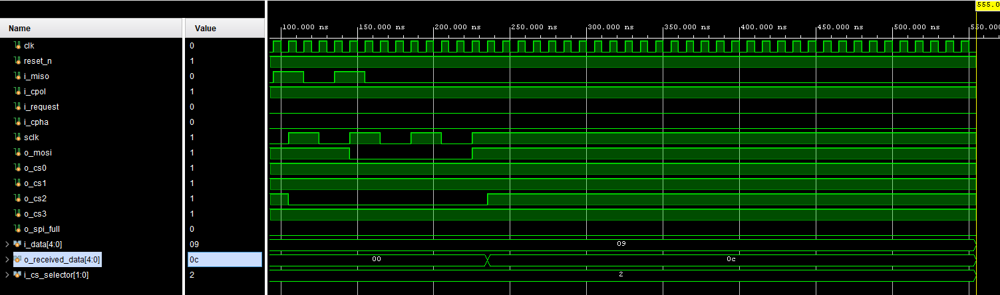
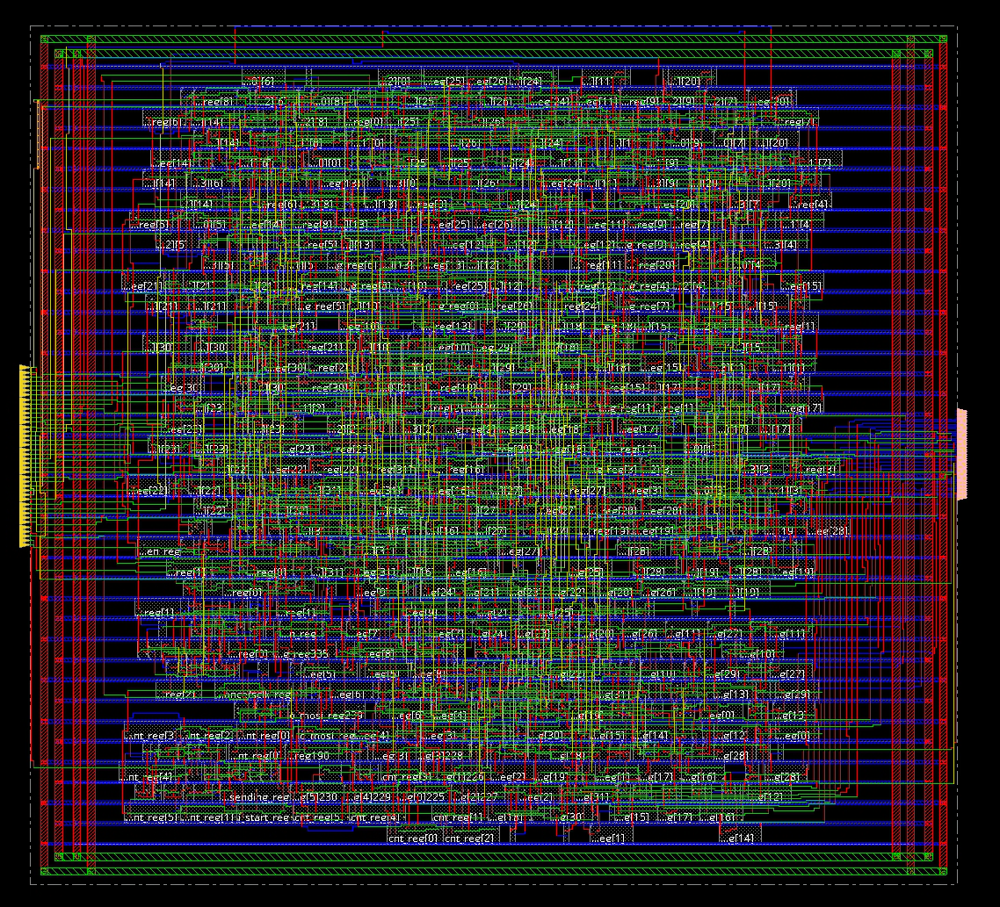

# High-Performance ASIC SPI Master Controller

## Project Overview

This is project consist of the design and VLSI implementation of a super-efficient Serial Peripheral Interface (SPI) master controller. You know, SPI is a crucial protocol for connecting microcontrollers to things like sensors and flash memory in a System-on-Chip (SOC). It's considered the standard for short distance synchronous communication due to his full duplex capability and simple hardware requirements.
The main goal was to create a full synthetizable Verilog code for high speed performance and low area utilization, specifically targeting the TSMC 180 nm technology for the implementation.

## Key Features & Innovations

* **4-Mode Support:** This controller handles all four SPI modes, which is essential for working with different peripherals. This is managed by the **CPOL** (Clock Polarity) and **CPHA** (Clock Phase) inputs.
* **4-Slave Management:** Dedicated hardware is included to control up to four independent slave devices using Chip Select (CS) lines.
* **FIFO Buffer Integration:** To prevent the CPU from stalling and creating a bottleneck, we implemented an 4-entry First-In First-Out (FIFO) buffer. This decouples the main processor from the serial transaction, making data streaming much more efficient.
    * One buffer is for the 32-bit input data.
    * The other 2-bit buffer handles the chip select signal.
* **Configurable Serial Clock:** The clock generator is totally configurable ; you can derive a specific SPI baud rate from the system clock (`clk`) using a clock divider, which lets you match various slave speed requirements.

## System Architecture

I designed the whole thing modularly; the overall architecture is divided into three primary sub modules. This really helped with verification and scalability. 

### 1. FIFO Buffers

The two FIFO buffers are key to preventing a bottleneck. The CPU just provides the data and the correct Chip Select signal for one clock cycle, and then the SPI controller monitors the buffers and handles the whole transmission process autonomously.

### 2. Serial Clock Generator

This takes the main system clock (`clk`) and uses a configurable clock divider to produce the Serial Clock (`sclk`) at the correct baud rate. It also adjusts the idle state of `sclk` based on the input CPOL to support all SPI modes.

### 3. Finite State Machine (FSM) - Control Logic

This is the core, the brains of the operation. It manages the full duplex transmission (sending and receiving data at the same time) through four states :

* **IDLE:** Waiting for a new transmission request (`i_request`) to be high.
* **WRITE\_FIFO:** The CPU's data and Chip Select are written into the respective FIFO buffers.
* **SETUP:** Data is read from the FIFO, the Serial Clock starts, and the correct Chip Select line (`o_cs`) is asserted.
* **TRANSMITTING:** Data is sent out and received on the SCLK edges, based on the CPHA input. Once finished, it returns to IDLE.

## **Behavioral Simulation**

The SPI Master controller was tested using AMD Vivado and creating a testbench configuring the device for 4-bit data trasmission instead of 32-bit.

## Synthesis Results & Optimization

I ran two synthesis analyses for comparison, this helped show the trade-offs between speed and power. The synthesis was performed using Cadence RTL Compiler targeting the TSMC 180 nm library.

| Metric | Baseline Design | Clock Gating Optimization | Change |
| :--- | :--- | :--- | :--- |
| **Max Frequency** | 285.5 MHz | 224.7 MHz | 21.3% Decrease  |
| **Total Power** | 0.77 mW | 0.37 mW | **52.2% Reduction** |
| **Total Area** | $27,699 \mu m^{2}$| $23,425 \mu m^{2}$ | 15.4% Reduction |
| **FIFO Power** | 0.37 mW | 0.10 mW | **72.7% Reduction** |

### **The Power Optimization**

The initial design was super fast at $F_{max} = 285.5$ MHz, which significantly exceeds the initial 200 MHz target. However, the FIFO buffers were consuming about 48% of the total energy due to the constant clock switching activity.

Since most SPI peripherals only need about 10–50 MHz, the final optimized version will be more valuable. I optimized the design for low power using **automated Integrated Clock Gating (IGC)**. This replaced multiplexer-based loops with IGC cells  and reduced the total power consumption by a huge **52.2%** , which is really critical for modern, low-power SOCs!

## **Physical Layout**

This is the layout generated using Cadence Innovus!

## **Additional Information**
Final Report in IEEE format: [PDF Report](SPI_Module.pdf)
